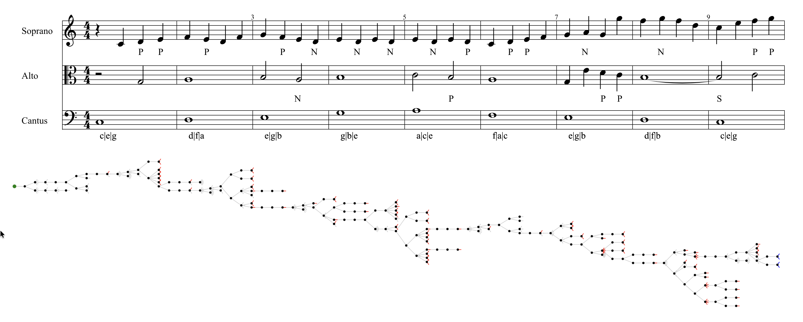

# `passacaglia`, Op.1

> Dedicated to Nikolai Y. Myaskovsky

A suite of libraries about music theory and procedural music generation, in early-stage development.

- [`common`](./packages/common/) contains shared utility classes, types and functions that are not related to music. Most importantly, it provides `Rational` and `HashMap` which are used everywhere.

- [`core`](./packages/core/) contains definitions for basic musical elements: `PitchSystem`, `Pitch`, `Interval` and `Scale`. These are abstract classes, agnostic on the musical system used, as long as the system consists of a fixed frequency period and a number of pitch classes. We also provide the standatd heptatonic pitch system used in common-practice Western music as a reference implementation. It also contains abstract classes for generic musical structures (or “containers”, like measures, voices etc) which can be navigated with cursors.
  > Currently, the typing of containers and cursors is buggy.

- [`musicxml`](./packages/musicxml/) contains some utility functions to emit MusicXML from musical containers.
  > Currently, MuseScore doesn’t yet accept the output, but OSMD (OpenSheetMusicDisplay) can handle it correctly.

- [`species-counterpoint`](./packages/species-counterpoint/) implements a ruleset for scholar species counterpoint and provides a flexible solver based on a variant of A* algorithm.

- `serialism` will provide several utilities to generate and manipulate tone rows and other serialist structures.

## Using the debug interface

We provide [`debug-ui`](./apps/debug-ui/) as a development server for testing and visualization. Use `pnpm` to install the dependencies and run `pnpm run dev` at the project root to start the local server.

